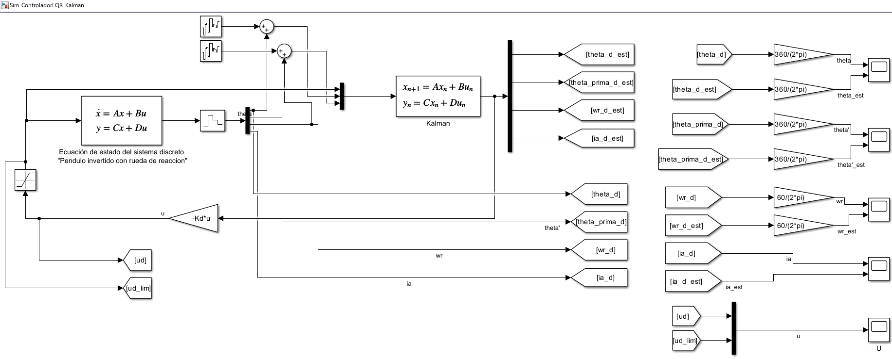
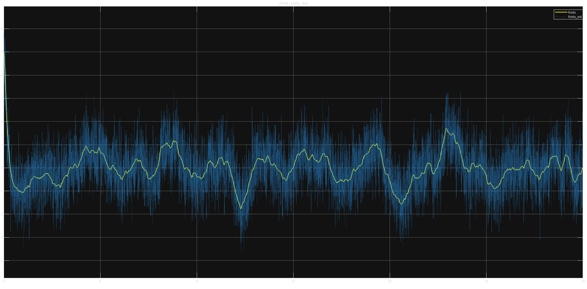

# Péndulo Invertido con Rueda de Reacción

> **Estado del Proyecto:** 🚧 En desarrollo (Fase MIL Completada - Transición a SIL)

Este repositorio contiene el desarrollo, simulación e implementación de las leyes de control para un péndulo invertido estabilizado mediante una rueda de reacción. El proyecto se rige estrictamente por la metodología **Model-Based Design (MBD)**, abarcando desde la derivación de las ecuaciones físicas y el diseño de observadores, hasta la futura autogeneración de código C/C++ para sistemas embebidos.

## 🎯 Objetivo del Proyecto

Diseñar y validar una arquitectura GNC (Guiado, Navegación y Control) para un sistema físicamente inestable, integrando un regulador óptimo y un estimador predictivo para lidiar con el ruido de los sensores y las no linealidades de los actuadores físicos.

## 🛠️ Arquitectura de Hardware (Target)

El diseño del software está condicionado por las siguientes especificaciones físicas:

* **Microcontrolador:** STM32 Nucleo-F401RE (ARM Cortex-M4 con FPU).
* **Sensor Inercial:** MPU6050 (Acelerómetro y Giroscopio por I2C).
* **Actuador:** Motor DC JGA25-370 12V con reductora y Encoder rotativo.
* **Etapa de Potencia:** Driver puente H BTS7960 (43A).

## 🧠 Estrategia de Control y Estimación

El sistema se ha linealizado alrededor de su punto de equilibrio vertical, obteniendo un modelo en espacio de estados de 4 variables: $x = [\theta, \dot{\theta}, \omega_r, i_a]^T$

### 1. Controlador LQR (Linear Quadratic Regulator)

Se ha implementado un control óptimo por realimentación de estados. Las matrices de penalización $Q$ y $R$ se han sintonizado utilizando la Regla de Bryson, basándose en las tolerancias físicas máximas admisibles.

### 2. Filtro de Kalman Discreto (Observador)

Dado que el sensor MPU6050 introduce ruido gaussiano, se ha implementado un Filtro de Kalman discreto para estimar el vector de estados completo. El estimador predictor se define mediante la ecuación:

$$\hat{x}(k+1) = (G - L_d C_{med})\hat{x}(k) + [H, L_d] \begin{bmatrix} u(k) \\ y_{med}(k) \end{bmatrix}$$

## 📊 Resultados: Model-in-the-Loop (MIL)

*Arquitectura del controlador y observador implementada en Simulink.*

*Filtrado y estimación del ángulo de inclinación $\theta$ frente al ruido inyectado.*

## 🚀 Hoja de Ruta (Roadmap MBD)

- [x] **Fase 1: Modelado Matemático.** Derivación de inercias, linealización y comprobación de controlabilidad/observabilidad.
- [x] **Fase 2: Model-in-the-Loop (MIL).** Simulación matemática ideal en PC (Planta + LQR + Kalman + Ruido Blanco).
- [ ] **Fase 3: Software-in-the-Loop (SIL).** Separación de bloques lógicos y generación de código C/C++ del controlador.
- [ ] **Fase 4: Processor-in-the-Loop (PIL).** Ejecución del algoritmo en la STM32 interactuando con la planta virtual.
- [ ] **Fase 5: Hardware-in-the-Loop (HIL) y Despliegue Físico.** Compensación de zonas muertas y validación con el hardware real.
- [ ] **Fase 6: Seguimiento de Objetivos (Visual Computing).** Implementación de algoritmos de visión artificial para identificar un objetivo y orientar el eje del sistema hacia él (Target Tracking).
- [ ] **Fase 7: Navegación Autónoma Avanzada.** Fusión de datos para misiones de apuntado y mantenimiento de actitud compleja.

## ⚙️ Tecnologías Utilizadas

* MATLAB / Simulink (Control Systems Toolbox, Embedded Coder)
* OpenCV / Python (Para la fase de Visual Computing)
* C/C++

---
**Autor:** Alen Garcia | Ingeniero en Electrónica Industrial y Automática
