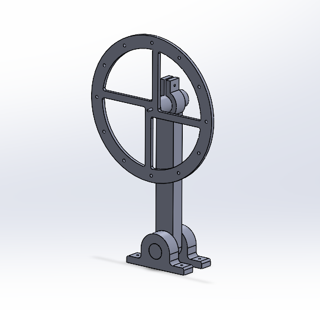

# Péndulo Invertido con Rueda de Reacción



> **Estado del Proyecto:** MIL Validado | Preparando SIL y Validación Mecánica

Este repositorio contiene el desarrollo, simulación e implementación de las leyes de control para un péndulo invertido estabilizado mediante una rueda de reacción (*Reaction Wheel Inverted Pendulum - RWIP*). El proyecto sigue estrictamente la metodología **Model-Based Design (MBD)**, cubriendo todo el ciclo de desarrollo desde el modelado matemático y diseño de controladores hasta la futura autogeneración de código embebido para una plataforma STM32.

---

## Objetivo del Proyecto

Diseñar, simular e implementar una arquitectura GNC (*Guidance, Navigation and Control*) capaz de estabilizar un sistema físicamente inestable mediante técnicas modernas de control óptimo y estimación de estados.

El objetivo final es desplegar un controlador LQR junto con un Filtro de Kalman discreto sobre hardware embebido real, validando progresivamente cada etapa mediante la metodología MIL → SIL → PIL → HIL → Hardware.

---

## Modelo Físico

El sistema se modela como un péndulo invertido de un grado de libertad accionado mediante una rueda de reacción acoplada a un motor DC.

El modelo dinámico considera:

- Dinámica gravitatoria del conjunto.
- Acoplamiento entre péndulo y rueda de reacción.
- Modelo eléctrico del motor DC.
- Inercia equivalente de la rueda de reacción.
- Efectos de la distribución de masas.
- Linealización alrededor del equilibrio vertical.

Las dimensiones mecánicas se han desarrollado a partir de un diseño propio inspirado en la plataforma RWIP presentada por el Instituto Tecnológico de Buenos Aires (ITBA), adaptándola a una implementación de bajo coste basada en sensores MEMS y fabricación aditiva.

---

## Arquitectura de Hardware (Target)

El diseño del software está condicionado por las siguientes especificaciones físicas:

| Componente | Selección |
|------------|------------|
| Microcontrolador | STM32 Nucleo-F401RE |
| Sensor Inercial | MPU6050 (I2C) |
| Actuador | Motor DC Pololu #4882 12V con reductora |
| Sensor de velocidad | Encoder incremental |
| Driver de potencia | BTS7960 |
| Estructura | Impresión 3D (PLA/PETG) |
| Eje principal | Varilla de acero Ø8 mm |
| Rodamientos | 608ZZ |

---

## Diseño Mecánico

La estructura está formada por:

### Brazo del Péndulo

- Longitud eje a eje: 207 mm
- Fabricación mediante impresión 3D
- Diseño optimizado para minimizar masa y maximizar rigidez

### Rueda de Reacción

- Diámetro exterior: 210 mm
- Configuración tipo anillo (*hoop-like*)
- Cuatro radios estructurales
- Taladros perimetrales M4 para ajuste experimental de inercia
- Distribución de masa concentrada en el perímetro

### Sistema de Pivote

- Eje rectificado de acero de 8 mm
- Dos rodamientos 608ZZ
- Diseño orientado a minimizar la fricción mecánica

### CAD

> Diseño preliminar del péndulo invertido con rueda de reacción desarrollado en SolidWorks. La estructura incorpora una rueda de reacción tipo anillo optimizada para maximizar la inercia, un brazo ligero fabricado mediante impresión 3D y un sistema de pivote basado en eje de acero de 8 mm y rodamientos 608ZZ. Los taladros perimetrales permiten ajustar experimentalmente la distribución de masa mediante tornillería M4.

---

## Estrategia de Control y Estimación

El sistema se ha linealizado alrededor de su punto de equilibrio vertical obteniendo un modelo en espacio de estados.

### Vector de Estado

```text
x = [theta, theta_dot, omega_r, i_a]^T
```

donde:

- **theta** = ángulo del péndulo
- **theta_dot** = velocidad angular del péndulo
- **omega_r** = velocidad angular de la rueda de reacción
- **i_a** = corriente de armadura

---

### Controlador LQR

Se implementa un regulador cuadrático lineal (*Linear Quadratic Regulator*) diseñado a partir de la Regla de Bryson.

La función de coste minimizada es:

```text
J = ∫ (xᵀQx + uᵀRu) dt
```

donde:

- **Q** penaliza las desviaciones de los estados.
- **R** penaliza el esfuerzo de control aplicado por el actuador.

---

### Filtro de Kalman Discreto

Las medidas proporcionadas por el MPU6050 y el encoder contienen ruido e incertidumbre.

Para reconstruir el estado completo del sistema se implementa un observador basado en Filtro de Kalman discreto.

La ecuación de predicción utilizada es:

```text
x_hat(k+1) =
(G - Ld·Cmed)·x_hat(k)
+
[H  Ld]·[u(k); ymed(k)]
```

donde:

- **Ld** es la ganancia del observador.
- **G** y **H** son las matrices discretizadas del sistema.
- **ymed(k)** representa las medidas procedentes del MPU6050 y del encoder.

---

## Resultados: Model-In-The-Loop (MIL)

### Arquitectura Simulink


*Implementación del controlador LQR, observador de Kalman y planta simulada.*

---

### Estimación de Estados


*Comparación entre la señal real, la señal ruidosa y la estimación obtenida mediante el Filtro de Kalman.*

---

## Metodología Model-Based Design

El desarrollo sigue una estrategia incremental de validación.

### Fase 1 — Modelado Matemático

- [x] Derivación del modelo dinámico
- [x] Cálculo de inercias
- [x] Linealización
- [x] Verificación de controlabilidad
- [x] Verificación de observabilidad

### Fase 2 — Model-In-The-Loop (MIL)

- [x] Simulación de la planta
- [x] Diseño LQR
- [x] Diseño del Filtro de Kalman
- [x] Validación funcional en MATLAB/Simulink

### Fase 3 — Software-In-The-Loop (SIL)

- [ ] Generación automática de código C/C++
- [ ] Verificación funcional del código generado

### Fase 4 — Processor-In-The-Loop (PIL)

- [ ] Ejecución del algoritmo en STM32
- [ ] Comparación con resultados MIL/SIL

### Fase 5 — Hardware-In-The-Loop (HIL)

- [ ] Integración de periféricos reales
- [ ] Validación de entradas/salidas
- [ ] Pruebas de tiempo real

### Fase 6 — Despliegue Físico

- [ ] Integración mecánica completa
- [ ] Calibración del MPU6050
- [ ] Compensación de fricción
- [ ] Compensación de backlash
- [ ] Estabilización del prototipo físico

---

## Líneas Futuras

Una vez completado el sistema RWIP se estudiarán extensiones orientadas a robótica autónoma:

- Seguimiento visual de objetivos mediante OpenCV.
- Integración con sistemas de telemetría IoT.
- Desarrollo de un Gemelo Digital conectado a la nube.
- Implementación de algoritmos avanzados de navegación y guiado.

---

## Tecnologías Utilizadas

### Modelado y Control

- MATLAB
- Simulink
- Control System Toolbox
- Simulink Control Design

### Sistemas Embebidos

- Embedded Coder
- STM32CubeIDE
- STM32 HAL

### Diseño Mecánico

- SolidWorks
- Fabricación aditiva (FDM)

### Desarrollo Software

- C
- C++
- Python

### Visión Artificial (Futuro)

- OpenCV

---

## Referencias

[1] Belascueny, G., Aguilar, N.

**Design, Modeling and Control of a Reaction Wheel Balanced Inverted Pendulum**

Instituto Tecnológico de Buenos Aires (ITBA).

[2] Franklin, G. F., Powell, J. D., Emami-Naeini, A.

**Feedback Control of Dynamic Systems**

Pearson.

[3] Grewal, M. S., Andrews, A. P.

**Kalman Filtering: Theory and Practice Using MATLAB**

Wiley.

---

## Autor

**Alen Garcia**

Ingeniero en Electrónica Industrial y Automática

Proyecto — Control Óptimo y Sistemas Embebidos mediante Model-Based Design
